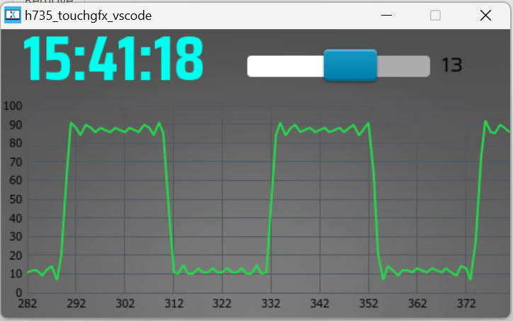
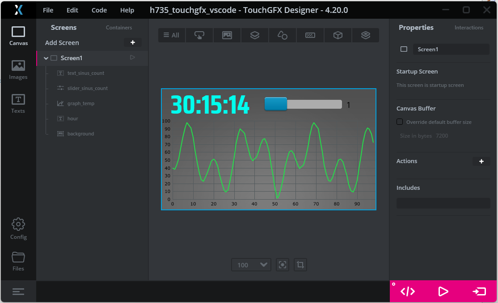
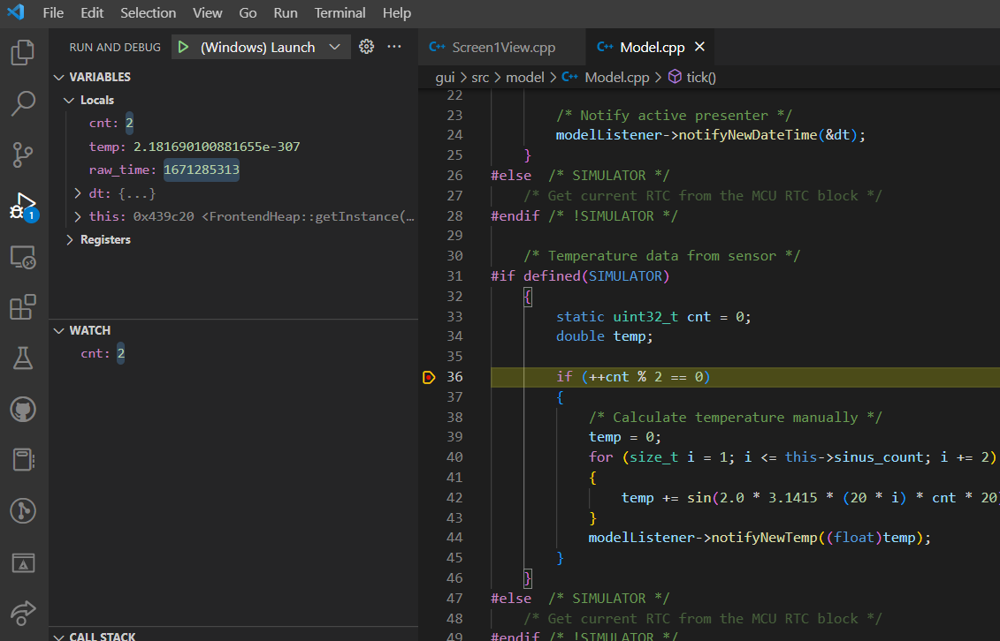

# TouchGFX simulator development in Visual Studio Code with CMake

Objective of this repository is to explain how to develop TouchGFX simulator application using Visual Studio Code and CMake.

Full tutorial and explanation available [on my webiste](http://stm32f4-discovery.net/2022/12/touchgfx-simulator-development-in-visual-studio-code-with-cmake/)

## Images

